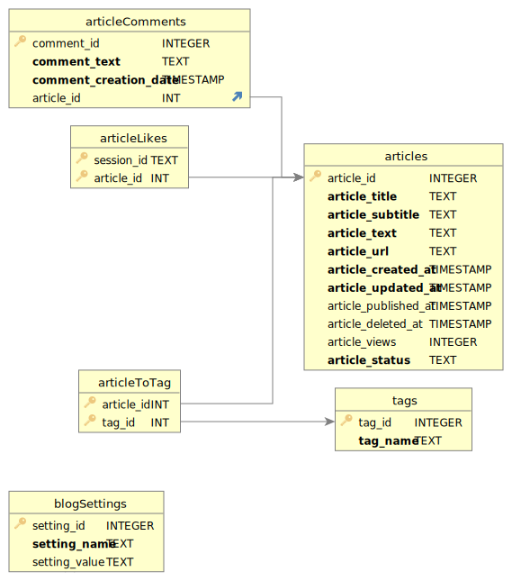

# CM2040 Database Networks and the Web Midterm Coursework by Ilya Amelevich

- [CM2040 Database Networks and the Web Midterm Coursework by Ilya Amelevich](#cm2040-database-networks-and-the-web-midterm-coursework-by-ilya-amelevich)
  - [Requirements](#requirements)
  - [Getting started](#getting-started)
  - [Commands](#commands)
  - [File structure](#file-structure)
  - [Extra tools used](#extra-tools-used)
  - [Extra libraries](#extra-libraries)
  - [DB Schema](#db-schema)
  - [Submission requirements](#submission-requirements)
    - [Data requirements](#data-requirements)
    - [Code Style Requirements](#code-style-requirements)
    - [Base requirements](#base-requirements)
      - [Author - Home Page](#author---home-page)
      - [Author - Settings Page](#author---settings-page)
      - [Author - Edit Article Page:](#author---edit-article-page)
      - [Reader - Home Page](#reader---home-page)
      - [Reader - Article Page](#reader---article-page)
    - [Extension](#extension)

## Requirements

- [NodeJS](https://nodejs.org/en/) - version 18.12.0 or above (tested on 18.12.1)
- [NPM](https://www.npmjs.com/) - version 9.2.0 or above (tested on 9.2.0)
- [Sqlite](https://www.sqlitetutorial.net/download-install-sqlite/) - version 3.39.4 or above (tested on 3.39.4 2022-09-07 20:51:41 6bf7a2712125fdc4d559618e3fa3b4944f5a0d8f8a4ae21165610e153f77aapl)

## Getting started

- Install deps: `npm i`
- Create DB: `npm run build-db`
- Start App: `npm run start`

## Commands

| Command             | Description                                                                            |
| ------------------- | -------------------------------------------------------------------------------------- |
| `npm run build-db`  | Build Sqlite DB. Creating database.db in project root                                  |
| `npm run clean-db`  | Remove database.db from project root                                                   |
| `npm run prepare`   | Setup git hooks with Husky                                                             |
| `npm run start`     | Start "prod" version. Just execute index.mjs                                           |
| `npm run start:dev` | Start dev version with livereload in browser and files watcher to restart node process |
| `npm run test`      | No test there. So just echo and exit with code 1                                       |
| `npm run watch:css` | Watch and compile [TailwindCSS](https://tailwindcss.com/)                              |

## File structure

- `.husky` - [Husky](https://typicode.github.io/husky/#/) for git hooks
- `.vscode` - Some vscode setup for this project
- `lib` - libs to make usage of logger and db easier without usage of global scope. Not production ready and clean solution, but it's work and okay I think for midterm coursework
- `public` - css and js for the browser
  - `app.js` - Some global JS code that more comfortable to write like that
  - `dist.js` - compiled [TailwindCSS](https://tailwindcss.com/) styles
  - `source.js` - source styles for [TailwindCSS](https://tailwindcss.com/)
- `repositories` - code to communicate with DB
- `routes` - routes definition
- `views` - EJS views
  - `admin` - EJS views for Admin part
  - `layout` - EJS Layout
  - `partials` - Some EJS blocks that can be included in other pages
- `.editorconfig` - Config to setup editor
- `.envrc` - File to setup [direnv](https://github.com/asdf-community/asdf-direnv)
- `.eslintrc.cjs` - [ESLint](https://eslint.org/) settings
- `.gitignore` - Describe files that should be ignored by Git
- `.prettierrc.cjs` - [Prettier](https://prettier.io/) config
- `.tool-versions` - File to setup all tool versions. Used by [asdf](https://asdf-vm.com/)
- `app.mjs` - Setup express server, register all plugings nad routes
- `db_schema.sql` - File with SQL to create Sqlite DB
- `index.mjs` - Start point to command `npm run start`
- `livereload.mjs` - Start point to command `npm run start:dev`. Add livereaload to browser
- `package-lock.json` - Lock file for NPM
- `package.json` - Package info. All deps and etc.
- `tailwind.config.cjs` - [TailwindCSS](https://tailwindcss.com/) config file

## Extra tools used

- [asdf](https://asdf-vm.com/) and [direnv](https://github.com/asdf-community/asdf-direnv) to setup nodejs version. Not required to start or use app.
- [ESLint](https://eslint.org/) and [Prettier](https://prettier.io/) to use code style. Will be installed by NPM as dev dependencies.
- [TailwindCSS](https://tailwindcss.com/) to style application. This is also library, but it can be used also as compiler to create final CSS.
- [VS Code](https://code.visualstudio.com/) IDE to write code, test it and much more
- [nodemon](https://nodemon.io) and [livereload](https://github.com/napcs/node-livereload#readme) for more comfortable development. Add live reload to browser and restart node app when some files were changed. Will be installed by NPM as dev dependencies.
- [Husky](https://typicode.github.io/husky/#/) for git hooks
- [lint-staged](https://github.com/okonet/lint-staged) to run prettier and lint only for changed files on beforecommit hook.

## Extra libraries

- `body-parser` - Parse body in express
- `express-session` - Sessions for express
- `express-validator` - Validation for express
- `pino` - Logger
- `pino-http` - Logger for HTTP server, that add some extra info on each request
- `promised-sqlite3` - wrapper for sqlite library that adds Promise support
- [AlpineJS](https://alpinejs.dev/) - frontend js framework, that add a lot of cool features from big frameworks, but super lightweight and easy to use

## DB Schema

## Submission requirements

### Data requirements

- [x] Pages must populate with user data dynamically retrieved from the server. This can be done through templating (as taught in this course), or through other means (eg. javascript requests and DOM manipulation).
- [x] Features relying on hard-coded client-side user data will be disregarded
- [x] All user data must be persistently stored in the SQLite database

### Code Style Requirements

- [x] Frontend code comprises template files (.ejs) in the views folder and optionally assets and .js files in the public folder
- [x] Backend code comprises an index.js file with routes implemented as middleware in the routes folder.
  - Application code in `app.mjs`, cause wanted to separate prod and dev versions and don't repeat code.
- [x] Each route should be preceded by a comment describing its purpose, inputs, and outputs
- [x] Routes should be rationally organised making appropriate use of GET, POST methods.
- [x] Each database interaction should be commented describing the purpose, inputs, and outputs.
- [x] Code should be laid out clearly with consistent indenting.
- [x] Functions and variables should have meaningful names, with a consistent naming style
- [x] All variables should be declared with careful attention to scoping

### Base requirements

#### Author - Home Page

It should be accessed through a URL which is distinct from the Reader Home Page

- [x] It should display the blog title, subtitle, and author name
- [x] It should have a second heading which makes it clear that this is the author page
- [x] It should have a link which points to the settings page
- [x] It should have a “Create new draft” button
  - [x] When pressed this should create a new draft article and redirect to it’s edit
        page
- [x] It should display a dynamically populated list of published articles
  - [x] The list should display useful information about the articles such as when they were created, published, and last modified, and number of likes
  - [x] For each article the list should display a sharing link which points to the relevant Reader - Article Page
  - [x] For each article there should be a delete button for the article. When pressed this should:
    - [x] Remove the article from the database
    - [x] Reload the page to display the updated information
      - No need to reload, updates articles list dynamically
- [x] It should display a dynamically populated list of draft articles
  - [x] The list should display useful information about the articles such as when they were created, published, and last modified
  - [x] Each article in the list should be accompanied by a link which points to its edit page
  - [x] For each article there should be a publish button. When pressed this should:
    - [x] Update the article’s state from draft to published
    - [x] Timestamp the publication date
    - [x] Reload the page to display the updated information
      - No need to reload, updates articles list dynamically
  - [x] For each article there should be a delete button.

#### Author - Settings Page

- [x] A title which indicates that this is the settings page
- [x] A form with text inputs for Blog title, subtitle, and author name.
  - [x] The form should be dynamically populated with the current settings for the page
  - [x] The form should have a submit button which updates the settings with the new values and redirects to the Author - Home Page.
  - [x] Form validation should be used to ensure that all fields have been completed ahead of submission.
- [x] A back button which points to Author - Home Page.

#### Author - Edit Article Page:

- [ ] Data about the article (Eg. created, last modified)
- [x] A form containing the following input fields and controls:
  - [x] Article title
  - [x] Article subtitle
  - [x] Article text
  - [x] A submit changes button
- [x] The form should be populated with the current article data
- [x] When changes are submitted the article’s last modified date should be changed
- [x] A back button which points to Author - Home Page.

#### Reader - Home Page

- [x] It should be accessed through a URL which is distinct from the Author - Home Page
- [x] It should display the blog title, subtitle, and author name
- [x] A list of published articles
  - [x] The article title and publication date should be visible for each item
  - [x] Articles should be ordered by publication date with the latest publication appearing at the top
  - [x] Clicking on an item in the list should take the user to the Reader - article page for that particular article

#### Reader - Article Page

- [x] It should display a single article determined by the url
- [x] It should display information about the article including, article title and subtitle, publication date, number of likes
- [x] It should display the text of the article
- [x] There should be a like button to react to the article
- [x] There should be form for adding a comment to the article containing
  - [x] A text input for the comment.
  - [x] A submit comment button
- [x] When the user submits a comment the page should be reloaded so that their comment appears in the list.
- [x] There should be a list of previous reader comments which should be ordered by the date when they were written
- [x] There should be a back button which redirects the user to the Reader - Home Page.

### Extension

- [x] Front end styling and GUI
  - [x] TailwindCSS was used for styling
  - [x] Dark and white themes were added with button to change
- [x] Add extra functionality
  - [x] Article views amount
  - [x] Article tags
  - [x] Dynamically load comments after adding new on article page
  - [x] Infinity scroll for reader home page with published articles
  - [x] Pagination on Admin home page for articles
- [x] Add a rich text editor
